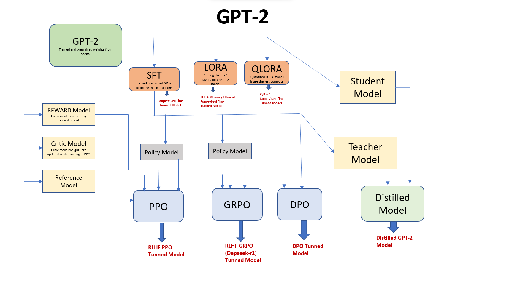

# GPT-2 Project: Training, Fine-Tuning, Alignment, and Distillation

This repository provides a comprehensive framework for working with GPT-2 models, including pretraining, supervised fine-tuning, preference alignment, reinforcement learning with human feedback (RLHF), and knowledge distillation. The project is structured to support various state-of-the-art techniques for efficient and effective language model training and alignment.

---

## Project Overview

The following diagram illustrates the overall workflow and model relationships in this project:

- **GPT-2**: The base pretrained model from OpenAI, serving as the foundation for all further training and adaptation.

---

## Key Concepts

### 1. Supervised Fine-Tuning (SFT)
Supervised Fine-Tuning adapts the pretrained GPT-2 model to follow specific instructions or perform particular tasks using labeled datasets. This step improves the model’s ability to generate responses aligned with user expectations.

### 2. Parameter-Efficient Fine-Tuning (LoRA, QLoRA)
- **LoRA (Low-Rank Adaptation):** Introduces additional trainable layers to the model, allowing efficient adaptation with fewer parameters and less compute.
- **QLoRA (Quantized LoRA):** Further optimizes LoRA by quantizing weights, making fine-tuning even more memory and compute efficient.

### 3. Preference Alignment
Preference alignment ensures that the model’s outputs align with human preferences or specific reward signals. This is achieved through several methods:
- **Direct Preference Optimization (DPO):** Directly optimizes the model to prefer outputs that are more aligned with human feedback.
- **Reinforcement Learning with Human Feedback (RLHF):** Uses human feedback to train a reward model, which then guides the policy model using reinforcement learning algorithms like PPO and GRPO.

### 4. Reward, Critic, and Reference Models
- **Reward Model:** Scores model outputs based on human preferences or predefined criteria.
- **Critic Model:** Evaluates the actions taken by the policy model during RL training, helping to improve learning.
- **Reference Model:** Serves as a baseline for comparing the current policy’s outputs during RLHF.

### 5. Policy Optimization Algorithms
- **PPO (Proximal Policy Optimization):** A reinforcement learning algorithm that updates the policy model to maximize the reward while maintaining stability.
- **GRPO (Group Relative Policy Optimization):** An extension of PPO that leverages group-based feedback for improved alignment.
- **DPO (Direct Preference Optimization):** Optimizes the model directly based on preference data without explicit reward modeling.

### 6. Knowledge Distillation
Knowledge distillation transfers knowledge from a large, complex teacher model to a smaller, more efficient student model. This process retains much of the teacher’s performance while reducing computational requirements, making deployment easier.

---

## Directory Structure

- `chat_gpt2/`: Core code for GPT-2, fine-tuning, and alignment.
- `chat_gpt2/distilled_gpt2/`: Knowledge distillation scripts and notebooks.
- `chat_gpt2/gpt2_core_model/`: Pretraining and core model utilities.
- `chat_gpt2/RLHF_DPO_GRPO_PPO_Preference_alignment/`: RLHF and preference alignment implementations.
- `Research_Papers.md`: Curated list of foundational and recent research papers.

---

## Getting Started

1. Clone the repository.
2. Set up your Python environment (see `requirements.txt`).
3. Explore the code in `chat_gpt2/` and related subdirectories.
4. Refer to the concept explanations above for theoretical background.

---

## License

See [LICENSE](LICENSE)

## References

For a full list of research papers and further reading, see [Research_Papers.md](Research_Papers.md).
